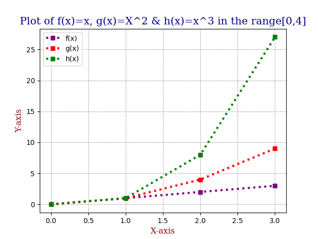

# Programming & Scripting Problem Sheet 2021 

## Fionn McCarthy - G00301126.
---
## Overview

This is the repository for the Programming and Scripting 2021 module weekly tasks - PANDS-PROBLEM-SHEET. I will outline each task, explain what the code is doing in each script and list the references used in the research of each of the problems. 

---
## Problem 1 - bmi.py
### Problem:
**Write a program that calculates somebody's Body Mass Index (BMI). Call the file bmi.py**

**The inputs are the person's height in centimetres and weight in kilograms.**
**The output  is their weight divided by their height in metres squared.**
### Code:
```python
weight = float(input('Please enter weight(kg):'))
height = float(input('Please enter height(cm):'))
heightinmetres = float(height/100)
BMI = weight/(heightinmetres**2)
print ('BMI is {:.2f}.'.format(BMI))
```
### Solution:
1. I used the input() fucntion in order to take an input from a user of height in centimeters and weight in kilogrammes. The inputs are both taken in as floats in order to allow for decimal point numbers. 
2. The height in centimeters is then coverted to height in meters and is stored in the variable heightinmetres.
3. The formula for caluclating BMI is used by divide the height in meters squared into the weight in kilogrammes.
4. We then print the result for BMI using the print().
### Input: 
**Please enter weight(kg): 65**
**Please enter height(cm): 180**
### Outputput: 
**BMI is 20.06.**
### References:
1. https://docs.python.org/3/library/functions.html python built in functions 28/02-2021
2. https://www.w3schools.com/python/python_numbers.asp python numbers w3schools 28/02-2021 
---
## Problem 2 - secondstring.py 
### Problem:
**Write a program that takes asks a user to input a string and outputs every second letter in reverse order.**
### Code:
```python
input_string = input('Please enter a sentence:')
print(input_string[::-2])
```
### Solution:
1. Initially the user is asked to input a sentence and the this is then called 'input_string'.
2. The method of string slicing is used in order to create a substring from the exisitng string that has been inputted. 
3. The syntax for this method is input_string[starting_position : end_position : step]. 
4. We will use teh full string in this case so there is no need to specify a start and end psootion here. For teh step we will use a negative in order to reverse the string and the number 2 would mean stepping every second letter. Therefore -2 being every second letter in reverse order.
5. This is then printed in order to return teh string inputted by the user in reverse order every second letter. 
### Input:
**Please enter a sentence: The quick brown fox jumps over the lazy dog.**
### Outputput:
**.o zletrv pu o wr cu h**
### References:
1. https://www.journaldev.com/23584/python-slice-string for the string slicing formula
2. https://docs.python.org/3/library/functions.html python built in functions 
---
## Problem 3 - collatz.py
### Problem:
**Write a program that asks the user to input any positive integer and outputs the successive values of the following calculation.**

**At each step calculate the next value by taking the current value and, if it is even, divide it by two, but if it is odd, multiply it by three and add one.**

**Have the program end if the current value is one.**
### Code:
```python
integer = int(input("Please input a positive integer:"))

if integer > 0:                             
    while integer != 1:                     
        print(integer)
        if (integer % 2) == 0:              
            integer = (integer // 2)        
        else:                               
            integer = (3 * integer + 1)     
else: 
    print("That number is not positive! Please input a positive number.")
```
### Solution:
1. The user is instructed to enter a positive integer, this is taken as an integer on teh input and stored as 'integer'.
2. The if statement is used in order to execute the next block of code only if the number is greater than zero (positive), if it is not positive teh user will be instructed to enter a positive integer.
3. The next block of code will be executed when the integer is positive which is a while loop.
4. The while loop will continue to run until the number reaches 1.
5. In the while loop first the number is printed then it will run an if else statement.
6. The if else staement runs by if the number is even it will divide the current number by 2 or else if it is odd it will multiply the number by 3 and add 1 to it. this loop will continue to print the number reached until it gets to 1.
7. Once 1 has been reached the program will stop.
### Input:
**Please input a positive number: 10**
### Outputput:
**10 5 16 8 4 2 1**
### References:
1. https://www.w3schools.com/python/python_conditions.asp 28/02/20201
2. https://www.w3schools.com/python/python_while_loops.asp 28/02/2021 
---
## Problem 4 - weekday.py
### Problem:
**Write a program that outputs whether or not today is a weekday.**

**(You will need to search the web to find how you work out what day it is)**

**An example of running this program on a Thursday is given below.**

$ python weekday.py


"Yes, unfortunately today is a weekday."


*An example of running it on a Saturday is as follows:*

$ python weekday.py


"It is the weekend, yay!"
### Code:
```python
import datetime 

daynumber = datetime.datetime.today().weekday() 

if daynumber < 5:
    print("Yes, unfortunately today is a weekday!") 
else:
    print("It is the weekend, yay!") 
```
### Solution:
1. From teheresearch I fount the module datetime can be used to work with dates as date objects.
2. In orde to get what day of the week it is we used datetime.datetime.today().weekday(). This will return the number (0 to 6) day of the week from the timestamp of execution.
3. Monday was 0 and Sunday was 6, therefore 0 to 4 were weekdays and 5 to 6 were weekends.
4. Using the above an if statement was used, if today the day number from the current datetime was less than 5 it would be a week day or else it would be a weekend.  
### References:
1. https://stackoverflow.com/questions/9847213/how-do-i-get-the-day-of-week-given-a-date get week of given date 28/02/2021 
---
## Problem 5 - squareroot.py
### Problem:
**Write a program that takes a positive floating-point number as input and outputs an approximation of its square root.**

**You should create a function called <tt>sqrt</tt> that does this.**

**I am asking you to create your own sqrt function and not to use the built in functions x ** .5 or math.sqrt(x).**

**This is to demonstrate that you can research and code a process (If you really needed the square root you would use one of the above methods).**

**I suggest that you look at the newton method at estimating square roots.**

**This is a more difficult task than some of the others, but will be marked equally, so only do as much work on this as you feel comfortable.**
### Code:
```python
def Sqrt(x_i): 
    n = float(x_i)
    precision = 10**(-10)              
    while abs(n-x_i*x_i) > precision:   
        x_i =  (x_i + n / x_i) / 2      
    return x_i

number = float(input("Enter a positive number:"))                               
if number > 0:                                                                  
    Squareroot = Sqrt(number)                                                   
    print("The approximate squareroot of {} is {} ".format(number, Squareroot))   
else:
    print("Please enter a positive number") 
```
### Solution:
1. Initially I define the function Sqrt(), where I set out what the function will do when ever it is called upon. Form the research I found..
2. 
3. 
4. The user is asked to input a positive number, it is set as a float to enable a decimal point number being entered here.  
5. The if statement is used in order to error handle a negative number being entered. 
6. Therefore if teh number is greatwer than 1 the blcok of code will be executed, which willl apply the sqrt() function defined previously to teh number entered and store it in 'Squareroot'.
7. The squareroot of the number is then printed. 
### Input:
**Enter a positive number: 14.5**
### Outputput:
**The approximate squareoot of 14.5 is 3.8078865529319628**
### References:
1. https://hackernoon.com/calculating-the-square-root-of-a-number-using-the-newton-raphson-method-a-how-to-guide-yr4e32zo 01/03/2021
2. https://www.math.ubc.ca/~pwalls/math-python/roots-optimization/newton/ 01/03/2021
3. https://www2.math.upenn.edu/~kazdan/202F09/sqrt.pdf 01/03/2021 
---
## Problem 6 - es.py
### Problem:
**Write a program that reads in a text file and outputs the number of e's it contains.**

**The program should take the filename from an argument on the command line.**
### Code:
```python
import sys 
filename = sys.argv[1] 

with open(filename, "r") as f:  
    filedata = f.read() 
    print(filedata.count('e')) 
```
### Solution:
1. The sys module is imported here as it will enable me to take the filename as an argument on the command line.
2. The sys.argv[1] takes the first command line argument.
3.  I looked for a text file online in order to use for this program, it is called psf.txt and is referneced below. 
4. The code will then open the file that was given on the command line in in read more "r". 
5. The files data is then stored in an object called filedata using the read() .  function as the data is read and then stored.
6. The function count() is used in order to count the number of e's in the filedata and prin the corresponding value. 
### Command line:
**python es.py psf.txt**
### Outputput:
**526**
### References:
1. http://textfiles.com/stories/psf.txt text file source accessed on 11/03/2021
2. https://www.w3schools.com/python/ref_file_read.asp read() on 11/03/2021
3. https://www.w3schools.com/python/ref_list_count.asp count() on 11/03/2021
4. https://askubuntu.com/questions/1059579/input-the-filename-in-the-commandline-as-an-argument-in-python file on command line 01/04/2021

---
## Problem 7 - plottask.py
### Problem:
**Write a program called plottask.py that displays a plot of the functions f(X)=X, g(X)=X<sup>2</sup> and h(X)=X<sup>3</sup> in the range [0, 4] on the one set of axes.**

**Some marks will be given for making the plot look nice.**
### Code:
```python
import numpy as np
import matplotlib.pyplot as plt

x = np.arange(0,4)
fx = x 
gx = x**2 
hx = x**3 

plt.plot(fx, marker = 's', color = 'purple' , ls = ':', lw = '3', label = 'f(x)') 
plt.plot(gx, marker = 's', color = 'red' , ls = ':', lw = '3', label = 'g(x)') 
plt.plot(hx, marker = 's', color = 'green' , ls = ':', lw = '3', label = 'h(x)') 

font1 = {'family':'serif','color':'darkblue','size':15} 
font2 = {'family':'serif','color':'darkred','size':12} 

plt.title("Plot of f(x)=x, g(x)=X^2 & h(x)=x^3 in the range[0,4]", fontdict = font1) 
plt.xlabel("X-axis", fontdict = font2) 
plt.ylabel("Y-axis", fontdict = font2) 

plt.grid(color = 'grey', ls = '--', lw = 0.5) 
plt.legend()
plt.savefig('plottask_output.png') 
plt.show()
```
### Solution:
1. The numpy and matplotlib.pupplot modules are imported in order to work with the array of numbers and then also in order to generate the plot of the given functions in the given range 0 to 4.
2. First I defined the functions to be plotted f(x), g(x) and h(x).
3. The plt.plot() function is used in order to plot f(x). It is plotted with square markers, purple colour, line style of':', line width of 3 and also teh label f(x) here is needed for the legend.
4. The plt.plot() function is used in order to plot g(x). It is plotted with square markers, red colour, line style of':', line width of 3 and also teh label g(x) here is needed for the legend.
5. The plt.plot() function is used in order to plot h(x). It is plotted with square markers, green colour, line style of':', line width of 3 and also teh label h(x) here is needed for the legend.
6. I created two font types font1 anf font2 for teh plot. Font1 will be used for the title and dofnt2 will be used for teh axis labels. 
7. I specified mt title string and to use font1 font type using plt.title.
8. I used plt.xlabel and plt.ylabel to label each axis and specified to use font2 font type.
9. In order to change how teh grid would look i used plt.grid to set the colour, style and width of the grid lines of the plot.
10. I then used plt.legend to include a legend on the plot, this will use teh labels I specified in plt.plot()
11. The image outputted form the above plot was saved using the plt.savefig() to save this plot before viewing.
12. Plt.show() then displays teh output form the plot. This can be seen below. 
#### Plot Output:
 

### References:
1. https://www.w3schools.com/python/matplotlib_intro.asp w3schools tutorial matplotlib 01/04/2021 
2. https://matplotlib.org/ 02/04/2021